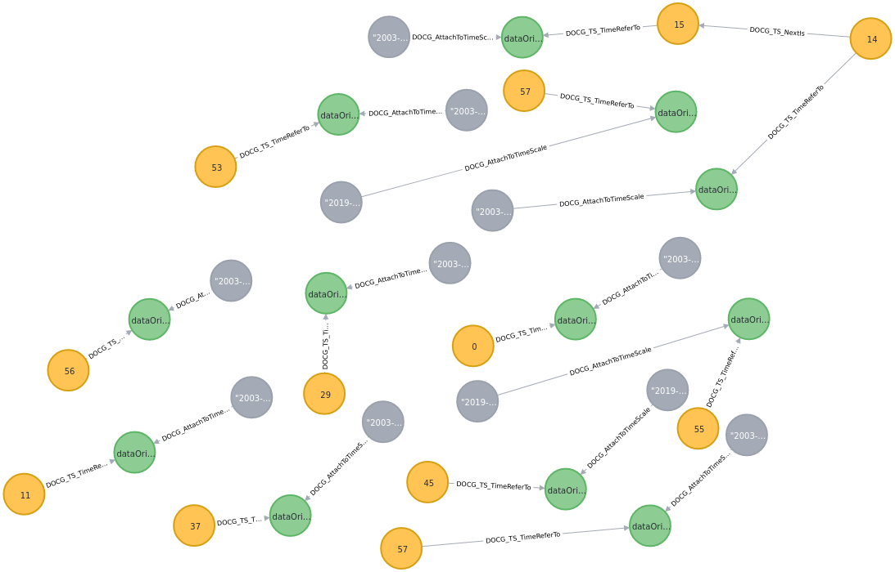
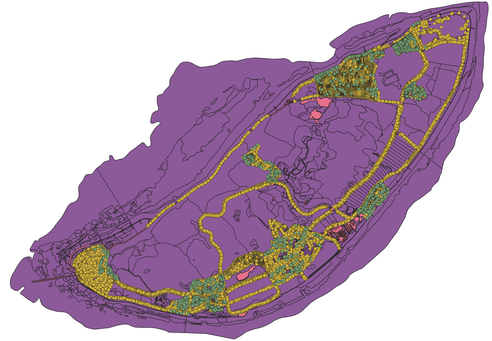

***
# <span style="color:#CE0000;"> Temporal Geographical Data Analytics Platform Development Guide


#### ➜ Overview 

TGDA platform based on Domain-Driven Design, A data analysis toolkit centered around graph data analysis and in-memory real-time computing technology. It can perform highly complex data analysis tasks using a business-oriented perspective, by utilizing capabilities such as relationship analysis, time analysis, and planar geographic spatial (GIS) analysis in a comprehensive manner that is easy to understand.

#### ➜ Term 

TGDA The business model of the data analysis platform uses the following terms to describe the concepts of various objects required to implement a business domain model. By combining the functions of these objects, all the data management and analysis-related business requirements for a specific domain model can be achieved.

**Type**：Conceptual types refer to the types of any real or logical concepts that can be included in a specific domain model. It includes the type of all attribute view types that can be contained in objects of this type, as well as the type definitions of relationship attachment rules that can be performed on objects of this type.

**Entity**：A conceptual entity is a real data representation of a specific conceptual type, which represents an objective object existing in the real world or a virtual object existing in a logical concept.

**Attribute**：Attribute types refer to the basic structure of a data information contained in a conceptual type. An attribute type includes the name of the attribute, its description, and the data type of the attribute.

**AttributesView**: An attribute view type is a view container that contains multiple attribute types. Multiple attribute types can be included in an attribute view type. The attribute view type is directly associated with the conceptual type, and it describes a collection of attribute information of a specific category included in a conceptual type.

**RelationshipType**: Relationship types describe a specific way of association between conceptual entities, such as a containment relationship between two entity objects in space or a dependency relationship between two entity objects logically.

**RelationshipEntity**: A relationship entity is a real data representation of a specific relationship type, representing an objective association between two conceptual entities in a specific domain model.

**RelationshipAttachmentRule**：Relationship attachment rules represent specific execution rules for linking entity data of two specific conceptual types to each other.

**Classification**：Classification represents a category of objectively existing, non-business-specific and non-analysis-specific dictionary concepts, such as gender, race, building type classification, etc. It generally interacts with various types of entity objects in a specific domain model and is an important goal for multidimensional data analysis in the domain model.

**TimeFlow**：A time stream is a representation of a continuous period of time, composed of various granularity time interval entities. It can be created, traversed, and accessed using various methods. Time streams are an important tool for temporal analysis in a domain model.

**TimeScaleEntity**：A time scale entity represents a specific point in time or a range of time within a time flow. It is a concrete representation of a time unit, such as a day, hour, or minute, and can be used to organize and analyze temporal data. Time scale entities are an important component of time series analysis and can be used to group and aggregate data based on temporal intervals.

**TimeScaleEvent**：An event represents a time-related occurrence of a regular concept entity at a specific moment. A regular concept entity is associated with a unique time-scale event at a specific time point, which is represented by a time-scale entity, to describe the business information of the concept entity at a specific time.

**Geospatial**：Geospatial refers to the entity representation of a geographical area. It includes a series of geospatial scale entities representing different levels of administrative divisions, with varying granularity. Geospatial regions can be created, traversed, and geospatial scale entities can be retrieved using various methods. Geospatial regions are an important way to conduct spatial analysis in a domain model.

**GeospatialScaleEntity**：Geospatial Scale Entity is a special type of concept entity, where each entity represents a specific administrative region, such as a country or a street community. A series of contiguous geospatial scale entities are interrelated, forming a part of the group that makes up a geospatial region. Through geospatial scale events, a geospatial scale entity can be associated with any number of concept entities to describe geolocation information required for spatial analysis.

**GeospatialScaleEvent**：Represents an event related to space, which describes a regular concept entity at a specific geographic location. A regular concept entity is associated with a unique geographic scale entity through a unique geographic scale event that represents the administrative division to which the location belongs. This is used to describe the business information of the regular concept entity at a specific geographic location.

The basic interaction relationships between the objects represented by each term are explained as follows：


###### ↳ Underground Pipeline Network Realm

A small domain model that contains conceptual entities:
 ***PipePoint***  （9696），  ***PipeTubulation*** （9281），relationship ***connectTo*** （17044）。

Example of a domain concept: 

Create a program:

```java
generator.realmExample.com.github.tgda.UndergroundPipelineNetwork_Realm_Generator
```

###### ↳ Song Playlists Realm

The medium domain model contains conceptual entities: ***Song***（quantity 9775） ， ***MusicTag***（quantity 250）  ，***Playlist***（188064），relationship ***playedInList*** （1790143）， ***belongsToMusicType***（149041).

Example:

Create a program:

```java
generator.realmExample.com.github.tgda.SongPlaylists_Realm_Generator
```

###### ↳ Seattle RealTime Fire 911 Calls Realm

The medium domain model contains conceptual entities: ***Fire911Call***(1471980), Timescale event entities ***occurredAt*** （1471980).

Example：

Create a program:

```java
generator.realmExample.com.github.tgda.SeattleRealTimeFire911Calls_Realm_Generator
```

###### ↳ Road Weather Information Stations Records Realm

The medium domain model contains conceptual entities: ***RoadWeatherRecords***（1790049）, Timescale event entities ***recordedAt*** （1790049）.

Example：

Create a program:

```java
generator.realmExample.com.github.tgda.RoadWeatherInformationStationsRecords_Realm_Generator
```

###### ↳ Island GeoSpatial Data Realm

The medium domain model contains conceptual entities:  ***IndividualTree*** ，***Frutex*** ，***FunctionalZone*** ，***SectionBlock*** ，***Road*** ，***Building*** ，***ConstructionLand*** .The data in this domain describes the facility and vegetation data of a small island, and all conceptual entities can be computed for geospatial type data analysis.

Example：

Create a program:

```java
generator.realmExample.com.github.tgda.Island_GeoData_Realm_Generator
```

#### ➜ Platform architecture components


###### *System architecture diagram*

